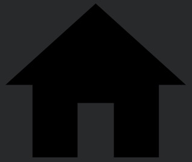
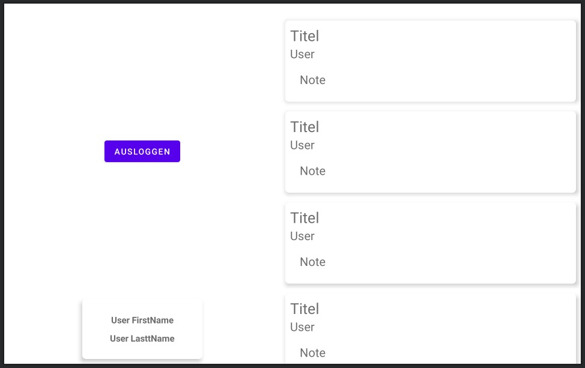
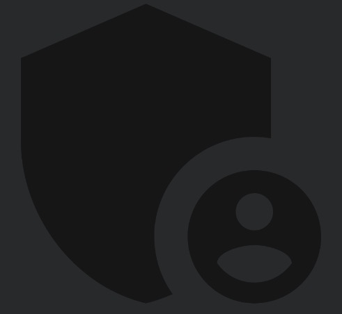
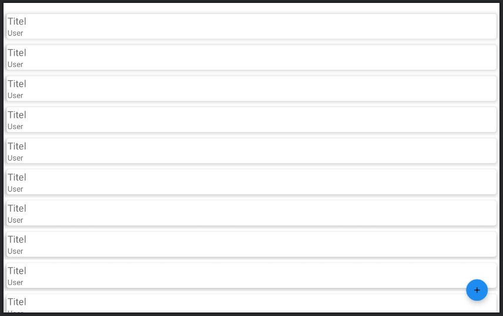
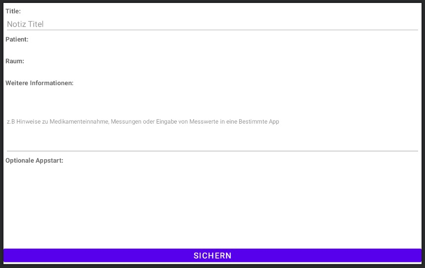
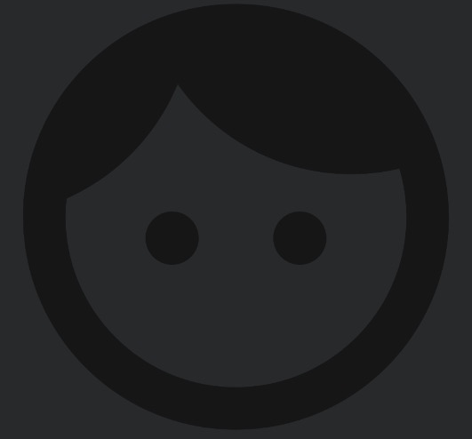
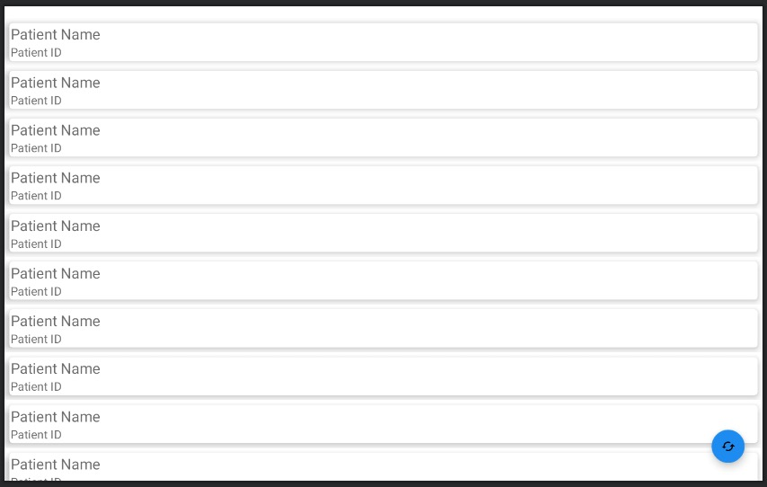
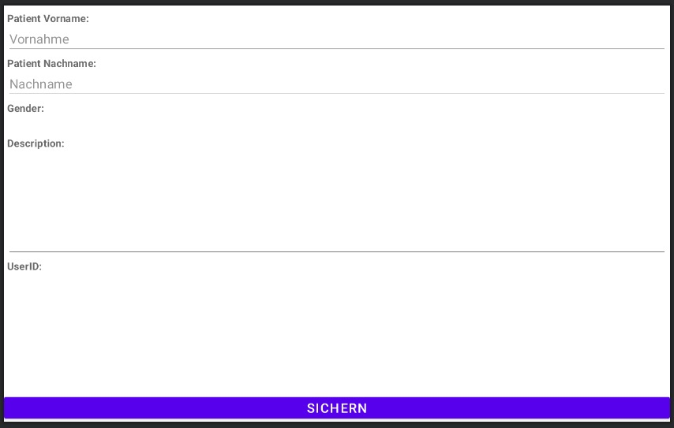
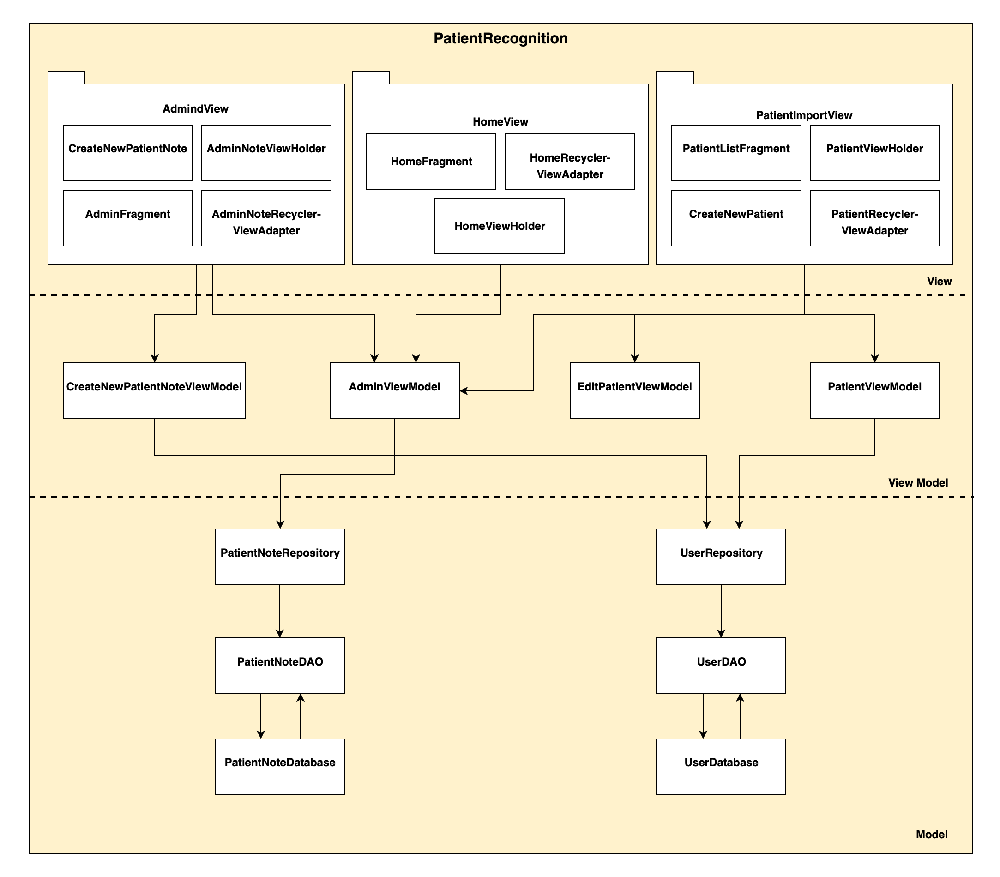

# PatientRecognition

The application allows you to save notes for patients’ medication advice, therapies, etc. In addition, the application synchronizes with the contacts stored in the Temi Center. Patients can access information through facial recognition. 

- [Installation Guide](https://github.com/ulygrz/PatientRecognition#installation-guide)
	- [Connect Computer to Robot](https://github.com/ulygrz/PatientRecognition#connect-computer-to-robot)
	- [Installing RemindMed](https://github.com/ulygrz/PatientRecognition#installing-remindmed)
	- [Uninstalling RemindMed](https://github.com/ulygrz/PatientRecognition#unstalling-remindmed)
- [App Features](https://github.com/ulygrz/PatientRecognition#app-features)
- [The PatientnRecognition App](https://github.com/ulygrz/PatientRecognition#)
	- [Home-Patient Menu](https://github.com/ulygrz/PatientRecognition#home-patient-menu)
	- [Admin Menu](https://github.com/ulygrz/PatientRecognition#admin-menu)
	- [Create a New Note](https://github.com/ulygrz/PatientRecognition#create-a-new-note)
	- [Patient's List](https://github.com/ulygrz/PatientRecognition#patients-list)
	- [Import Patients from the Temi Center](https://github.com/ulygrz/PatientRecognition#import-patients-from-the-temi-center)
- [Functions, Parameters and Architecture](https://github.com/ulygrz/PatientRecognition#unctions-parameters-and-architecture)
- [Patients's Information](https://github.com/ulygrz/PatientRecognition#Patients-information)
- [Note's Information](https://github.com/ulygrz/PatientRecognition#notes-information)
- [Information Management from the Database](https://github.com/ulygrz/PatientRecognition#information-management-from-the-database)
- [Users' database](https://github.com/ulygrz/PatientRecognition#users-database)
- [Notes' database](https://github.com/ulygrz/PatientRecognition#notes-database)
- [Face Recognition's features](https://github.com/ulygrz/PatientRecognition#face-recognitions-features)
- [Description of the Structure and Patterns](https://github.com/ulygrz/PatientRecognition#description-of-the-structure-and-patterns)


# **Installation Guide**
The first step is to install ADB on your computer. Follow [this](https://www.xda-developers.com/install-adb-windows-macos-linux) tutorial on how to download and set up ADB on your computer.
If you are using Android Studio is most likely that it is already installed.

## Connect Computer to Robot
Once you have ADB set up on your computer, you can run your code on temi by:
**Step 1:** Make sure you are connected to the same WiFi network as the temi.
**Step 2:** On temi go to settings -> temi Developer Tools -> tap on ADB Port Opening
**Step 3:** On the computer - Using the IP address on the top right of temi’s screen you can connect to the robot and test your code. In order to establish a connection with the robot, type the following command in Terminal on Mac or Command Prompt on Windows.

```sh
adb connect <IP_ADDRESS>:5555
```

## Installing RemindMed
Once you have established a connection between your computer and temi, you can install your app using two methods:

**1.** Directly through Android Studio by selecting the "rockchip rk****" and selecting Run.
**2.** By typing the following in the command line:

```sh
adb install [option] PATH_OF_APK
```

## Uninstalling RemindMed
Once you have established a connection between your computer and temi, you can uninstall your app on temi by typing the following in the terminal:

```sh
abd uninstall [option] PACKAGE_NAME
```


# **Apps Features** 
- Patients information management.
- Notes management.
- Patient face recognition.
- *In order to use the face recognition capabilities of the robot, the information of the patients must be stored in temi center with at least one photo of the patient. For more information follow the [Temi Center User Manual](https://github.com/temistore/usermanual/blob/master/Temi_Center_User_Guide.pdf)* 

# The Patientrecognition App

## Home-Patient menu
 The Home view shows the notes for the patient when he/she is recognized through face recognition.
In order to hide the displayed information, click on the button “Ausloggen”



## Admin Menu

 To access the admin menu, click on the icon, shown on the left, from the bottom bar. It displays the saved notes for all the patients. To delete a note swipe it to the side
In order to create a new note, click on the blue button “+”.



## Create a New Note
The patient can be selected in the patient spinner, it shows the name and the user ID.
To save the note click on “Sichern”.


## Patient's List
 The patient’s management is done at the patient’s list fragment, to access it press the button shown on the left.
The fragment displays the patients imported from the Temi Center. 
To import the patient’s information, click on the blue button. The Information received is incomplete, in order to complete the missing information, click on the blue marked item. It will open a new fragment with the received information of the patient. 



## Import patients from the Temi Center

Fill in the missing information in the corresponding fields and then click on “Sichern” to save the changes.
The Temi needs at least one patient’s photo to be able to recognize the patient. BE SURE TO UPLOAD THE NEEDED INFORMATION AND THE PHOTOS OF THE PATIENT IN THE TEMI CENTER BEFORE OF THE SYNCHRONIZATION.


# Functions, Parameters and Architecture

## Patient's information
To add or change the information requested and saved for new users. The changes have to be done in the class User.  
The parameters of User are: userID, firstName, lastName, description, gender, created. 
The class has also funtions to get these information: getFirstName(), getLastName(), getGender(), getUserId(), getDescription(), getCreated().

## Note's information
To add or change the information requested and saved it for new notes. The changes have to be done in the class PatientNote.  
The parameters of patientNote are: noteID, noteTitle, note, (patient)location, userID, username, action and created.
The class has get-functions for the parameters above.

## Information Management from the Database
Patient Recognition has two databases, a database for the users' information and a database for notes.
The information in the database can be accessed and changed through the ViewModel classes: PatientViewModel and NoteViewModel.  
**PatientViewModel** has the following methods: getAllPatientNotes, update, delete, insert, deleteAllPatientNotes. 
**NoteViewModel** has the following methods: getAllUsers, update, delete, insert, deleteAllPatients 

## Users' database
The storage of user data is done through the class UserRepository, it uses the classes UserDao and UserDatabase in the constructor.
The class UserRepository has the methods insert(), delete(), update(), deleteAll() and getAllUsers(), through these methods can the class PatientViewModel manage the saved users. 
All the actions in UserRepository are performed asynchronously 

## Notes' database
The storage of notes is done similarly, it uses the classes PatientNoteDao and PatientNoteDatabase.
Its methods are insert(), delete(), update(), deleteAll(), and getAllPatientNotes(). These methods are used by the PatientNotesViewModel to manage the notes for the patients.

## Face Recognition's features
The app uses the Temi’s face recognition capabilities through listeners in HomeFragment. These Listeners are onContinuousFaceRecognized() and onFaceRecognized().  
OnContinuousFaceRecognized() will receive continuously the contact information as a ContactModel-Object. 
OnFaceRecognized() will receive the contact information once and then stop. 

When a face is recognized the listener OnContinuousFaceRecognized() receives a list with the information of the recognized user, this information is organized through [ContactModel](https://github.com/robotemi/sdk/wiki/temi-Center#models). If the ContactModel isn't empty the method findNotesForRecognizedPatient() is called and it uses the userID, gotten from the ContactModel in OnContinuousFaceRecognized, to search the notes for the recognized user.

The notes saved in the database are obtained in the class onViewCreated through an observer and passed to the variable patienNotesList.

## Description of the Structure and Patterns
The app is based on a MVVM-Pattern and it has the following structure:



The databases are managed and accessed through Repository and DAO patterns. The Repository uses DAO to fetch data from the Databases and populate a domain object (I found it so, but I mean the database)  
 
In AdminView the AdminFragment uses AdminNoteRecyclerViewAdapter and AdminNoteViewHolder to display the notes for the patients as a List. The same happens in PatientImportView where PatientListFragment uses PatientRecyclerViewAdapter and PatientViewHolder to show the synchronized Patients. 
 
Also, AdmiFragment calls the class CreateNewPatientNote to create new notes and saves them in the PatientNoteDatabase. 
 
To edit the information of a patient, after being synchronized with the contacts in the Temi Center, PatientListFragment calls the class CreateNewPatient. Afterward, this class saves the changes in the Userdatabase. 
 
Finally, HomeFragment shows the saved notes for the recognized patient in a list by means of HomeRecyclerViewAdapter and HomeViewHolder. While AdminViewModel fetches all the notes for the patients saved in the PatientNoteDatabase. 

